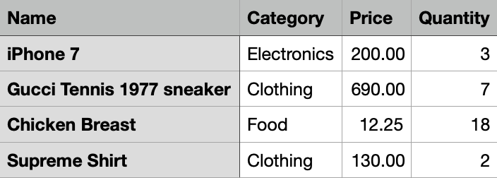

# Swifty CSV
Convert all of your in code models to a usable CSV.

**Installation**

Drag-n-drop the `SwiftyCSV.swift` file into your project.


**Before Using**


Pick the model you'd like to choose like this Product model.
```swift
struct Product {

    var name:String
    var category:Category
    var price:Decimal
    var quantity:Int
    
    enum Category:String {
        case electronics
        case food
        case clothing
    }
    
}
```

Make an array of your models
```swift
let testProducts:[Product] = [
    Product(name: "iPhone 7", category: .electronics, price: 200.0, quantity: 3),
    Product(name: "Gucci Tennis 1977 sneaker", category: .clothing, price: 690.0, quantity: 7),
    Product(name: "Chicken Breast", category: .food, price: 12.25, quantity: 18),
    Product(name: "Supreme Shirt", category: .clothing, price: 130, quantity: 2)
]
```

**Usage**

Create the CSV object

```swift
let myCSV = CSV<Product>(name: "Products", items: testProducts)
```
Each field name acts as a header for the list in the final CSV file.

Using keypaths, you can specify which model's property is associated with which CSV header.
```swift
myCSV.addField("Name", prop: \.name)
```

Using a closure, you can custom format the cell's text for a model's property
```swift
myCSV.addField("Category", prop: \.category) { (categoryString) -> String in
    return categoryString?.capitalized ?? myCSV.defaultNilValue
}

myCSV.addField("Price", prop: \.price) { (amount) -> String in
    if let amount = amount, let double = Double(amount) {
        return String(format: "%.2f", double)
    }else{
        return "0.0"
    }
}

myCSV.addField("Quantity", prop: \.quantity)
```
Create the data for the csv file by calling the `createData()` method
```swift
let data = try myCSV.createData()
```
and save it wherever you fancy.

```swift

///Example method that saves data to the documents folder.
func saveToDocuments(filename:String, data:Data) throws {
    let path = NSSearchPathForDirectoriesInDomains(.documentDirectory, .userDomainMask, true)[0] as String
    let url = URL(fileURLWithPath: path)
    var filePath = url.appendingPathComponent(filename + ".csv")
    //Append a number on the end of the file name if the name already exists.
    var copyNumber:Int = 0
    while FileManager.default.fileExists(atPath: filePath.path) {
        copyNumber += 1
        filePath = url.appendingPathComponent("\(filename)(\(copyNumber)).csv")
    }
    try data.write(to: filePath, options: .atomic)
}

///Implementation
let data = try myCSV.createData()
do {
    let data = try myCSV.createData()
    try saveToDocuments(filename: myCSV.name, data: data)
} catch (let error) {
    print(error.localizedDescription)
}
```

The code presented above creates this csv file.



**Other features**

For model properties that are null or empty you can use the  `defaultNilValue` and `defaultEmptyValue` properties to specify a default value.
```swift
///Cells that would normally be an empty string are set to "Not Set"
myCSV.defaultEmptyValue = "Not Set"
```

By default the CSV lists data row-by-row, but can also be presented column by column by setting

```swift
myCSV.listDirection = .horizontal`
```
